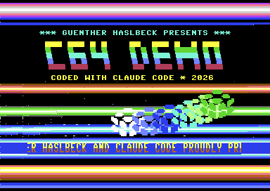

# C64 Demo - "C64 DEMO" by Günther Haslbeck & Claude Code (2026)

Ein Commodore-64-Cracktro in reinem 6502-Assembler. Entstanden auf einem MacBook,
ganz ohne echten C64: Günther hat im Terminal mit [Claude Code](https://claude.com/claude-code)
gesprochen, Claude hat den Assembler-Code geschrieben, der Emulator VICE hat ihn
ausgeführt und Screenshots haben gezeigt, wie das Ergebnis aussieht.



## Was das Demo zeigt

- **Wabberndes Logo** "C64 DEMO" aus 3x5-Blockbuchstaben. Jede Rasterzeile wird horizontal
  per Sinus verschoben (`$D016`), die Farben laufen als Regenbogen durch.
- **Regenbogen-Balken** im oberen und unteren Border.
- **Drei Copper-Bars**, die sich sinusförmig bewegen, dahinter der ganze Screen als Balkenfläche.
- **Sternenfeld** mit drei Parallax-Ebenen (24 Sterne), pixelweise weich gescrollt.
- **Doppelt hoher Scroller** auf einem schattierten Band, 2 Pixel pro Frame. Der Text erzählt
  auch, wie das Demo entstanden ist.
- **Sprite-Schlange** aus sechs Pulumi-Logos auf einer Achterbahn mit Farbwechsel.
- **SID-Musik** mit drei Stimmen: Arpeggios und Lead mit Pulsbreiten-Modulation, Bass,
  Kick/Snare/Hi-Hat und ein Filter-Sweep. 128 Schritte, dann Loop.

## Voraussetzungen (macOS)

```bash
brew install tass64   # Assembler (Befehl: 64tass)
brew install vice     # Emulator (x64sc), nur zum Ansehen/Testen
```

Außerdem Python 3 (nur Standardbibliothek für den Build). Für `test_demo.sh` mit
Screenshot-Auswertung ist nichts weiter nötig.

## Bauen

```bash
python3 build_demo.py    # erzeugt demo_data.inc und demo.prg
python3 make_d64.py      # optional: demo.d64 (Diskettenabbild)
```

`build_demo.py` erledigt zwei Dinge:

1. Es rechnet alle Tabellen aus (Sinus, Regenbogen, Musik, Sterne, Logo, Scrolltext,
   Sprite) und schreibt sie nach `demo_data.inc` (wird nicht eingecheckt).
2. Es ruft `64tass` auf, das `demo.asm` zusammen mit den Tabellen zu `demo.prg` assembliert.

## Starten

```bash
x64sc -autostart demo.prg                        # PRG direkt starten
x64sc -8 demo.d64 -keybuf 'load"*",8,1\nrun\n'  # von der Diskette (Kleinbuchstaben!)
```

Auf einem echten C64 oder in VirtualC64: `demo.d64` einlegen, dann

```
LOAD"*",8,1
RUN
```

Bei aktivierter Laufwerksemulation dauert das Laden ein paar Sekunden.

## Testen

```bash
./test_demo.sh
```

Baut das Demo, lässt VICE im Warp-Modus laufen und speichert `screenshot.png`.
Das Laden über das emulierte Laufwerk braucht rund 20 Mio. Zyklen, das Skript
läuft deshalb standardmäßig 45 Mio. Zyklen (Parameter 3 ändert das).

## Wie es funktioniert

Das Demo läuft im PAL-Timing (312 Zeilen). Kernal und BASIC sind abgeschaltet, das Programm
setzt eigene Interrupt-Vektoren.

**Raster-Stufen.** Vier Raster-Interrupts pro Bild, jeder wartet Zeile für Zeile und
schreibt Farben bzw. `$D016`:

| Zeilen  | Stufe                                              |
|---------|----------------------------------------------------|
| 20-50   | Regenbogen im oberen Border                        |
| 75-114  | Logo-Wobble (`$D016` pro Zeile)                    |
| 131-210 | Copper-Bars aus einem 80-Byte-Puffer               |
| 211-242 | Scroller-Band inkl. Fein-Scroll für die Zeilen 219-234 |
| 251-283 | Regenbogen im unteren Border, danach Frame-Flag    |

**Frame-Logik.** Die Hauptschleife wartet auf das Frame-Flag und erledigt dann: Logo-Farben,
Copper-Bar-Puffer, Sterne, Scroller, Sprites und Musik. Sterne und Bars müssen vor Zeile 131
fertig sein, der Scroller vor Zeile 219. Das freie CPU-Budget liegt bei rund 5800 Zyklen pro
Bild, aktuell bleiben etwa 2 Rasterzeilen Reserve. Wer Effekte hinzufügt, sollte das im Blick
behalten.

**Zeichensatz.** Beim Start wird der ROM-Zeichensatz nach `$3000` kopiert. Dazu werden erzeugt:
ein Vollblock für das Logo, 24 Stern-Glyphen (3 Ebenen x 8 Pixel-Offsets) und aus jedem
Zeichen eine obere und eine untere Hälfte für den doppelt hohen Scroller.

**Speicher.**

| Adresse       | Inhalt                                        |
|---------------|-----------------------------------------------|
| `$0801`       | BASIC-Zeile `SYS 2064`                        |
| `$0810-$1D..` | Code und Tabellen (muss unter `$3000` bleiben) |
| `$0400/$D800` | Bildschirm / Farb-RAM                         |
| `$3000`       | Zeichensatz                                   |
| `$3800`       | Sprite-Daten                                  |
| `$C000`       | Copper-Bar-Puffer                             |

Mehr Details (Zero-Page, Zeichensatz-Belegung) stehen in [`CLAUDE.md`](CLAUDE.md).

## Anpassen

Alles Inhaltliche steht oben in `build_demo.py`:

- **Texte:** `TITLE1`, `TITLE2`, `SCROLL` (Großbuchstaben, keine Umlaute)
- **Großes Logo:** `LOGO_TEXT` und die 3x5-Glyphen in `FONT` (maximal 40 Spalten breit)
- **Musik:** `CHORDS`, `ROOTS`, `BASSPAT`, `DRUMS`, `MELODY`
- **Farben:** `RAMPS`, `LOGO_COLORS`, `BAND`, `SPRITE_COLORS`
- **Sprite:** `SPRITE_DATA` (21 Zeilen à 3 Bytes)

Die Effekte selbst stehen in `demo.asm`. Nach jeder Änderung einfach `python3 build_demo.py`.

## Dateien

| Datei           | Zweck                                                   |
|-----------------|---------------------------------------------------------|
| `demo.asm`      | Quellcode des Demos (64tass)                            |
| `build_demo.py` | erzeugt die Tabellen und ruft den Assembler auf         |
| `make_d64.py`   | baut `demo.d64` aus `demo.prg`                          |
| `test_demo.sh`  | Build + VICE-Lauf + Screenshot                          |
| `demo.prg`      | fertiges Programm                                       |
| `demo.d64`      | fertiges Diskettenabbild                                |
| `docs/`         | Screenshot für dieses README                            |
| `games/`        | weitere C64-Projekte (BRICKSTORM)                       |

## Weitere Projekte

- [`games/brickstorm`](games/brickstorm/README.md) - **BRICKSTORM**, ein Breakout-Spiel für den C64
  (Joystick oder Tastatur, 5 Level, gepanzerte Steine, Musik und Effekte).

## Bekannte Einschränkungen

- Der Raster ist nicht zyklengenau stabilisiert. Auf Zeilen mit Sprites können die Balken am
  linken Rand leicht ausfransen.
- Ausgelegt auf PAL. Auf NTSC-Maschinen laufen die Effekte im unteren Bereich nicht sauber.
- Die Musik ist nur per Code geprüft, nicht Note für Note abgehört.
