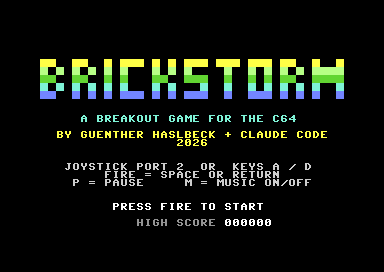
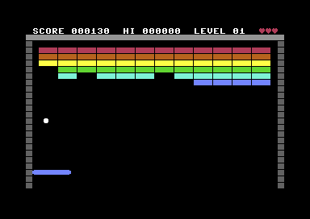

# BRICKSTORM - ein Breakout-Spiel für den C64

Breakout in reinem 6502-Assembler, geschrieben von Günther Haslbeck und
[Claude Code](https://claude.com/claude-code) (2026) auf einem MacBook, getestet im Emulator VICE.

| Titelbild | Spiel |
|-----------|-------|
|  |  |

## Spielen

Schläger unten steuern, den Ball nach oben lenken und alle Steine abräumen.
Wo der Ball auf den Schläger trifft, bestimmt den Abprallwinkel: Am Rand fliegt er flach,
in der Mitte steil. Je länger man spielt, desto schneller wird der Ball.

| Aktion           | Joystick (Port 2) | Tastatur              |
|------------------|-------------------|-----------------------|
| Schläger links   | links             | `A` oder `,`          |
| Schläger rechts  | rechts            | `D` oder `.`          |
| Start / Abschuss | Feuer             | `SPACE` oder `RETURN` |
| Pause            |                   | `P`                   |
| Musik an/aus     |                   | `M`                   |

- **Punkte:** obere Reihen zählen mehr (50 bis 10 Punkte je Stein).
- **Gepanzerte Steine** (grau, mit Rahmen) brauchen zwei Treffer und geben dann 5 + Steinpunkte.
- **3 Leben.** Ist der Ball unten durch, geht ein Herz verloren.
- **5 Level** mit unterschiedlichen Mustern und Farben (Vollwand, Schachbrett, Pyramide,
  Streifen, Raute). Danach geht es von vorn los, aber schneller.
- Der Highscore wird für die laufende Sitzung gemerkt.

## Bauen und starten

```bash
brew install tass64 vice      # Assembler und Emulator (einmalig)

cd games/brickstorm
python3 build.py              # -> brickstorm.prg
python3 build.py --d64        # -> brickstorm.prg + brickstorm.d64

x64sc -autostart brickstorm.prg
```

Auf einem echten C64 oder in VirtualC64: `brickstorm.d64` einlegen und

```
LOAD"*",8,1
RUN
```

## Testen

Ein Emulator-Test ohne Joystick geht mit dem Autoplay-Build, in dem der Computer den Schläger
selbst führt:

```bash
./test.sh                     # baut brickstorm_auto.prg und macht Screenshots
python3 build.py --autoplay   # nur bauen, dann: x64sc -autostart brickstorm_auto.prg
python3 build.py --autolose   # Schläger bleibt stehen (Test für Leben verlieren / Game Over)
```

Die Testversionen sind nur für die Entwicklung gedacht und werden nicht eingecheckt.

## Wie es funktioniert

- **Bildschirm:** Textmodus mit eigenem Zeichensatz bei `$3000` (ROM-Font plus Stein-, Panzer- und
  Wandzeichen). Steine sind je 3 Zeichen breit, 12 pro Reihe, 6 Reihen. Die Farbe kommt aus dem
  Farb-RAM. Ein Treffer löscht das Zeichen.
- **Sprites:** Sprite 0 ist der Schläger (24 Pixel, in X verdoppelt = 48 Pixel), Sprite 1 der Ball
  (6x6 Pixel). Beide liegen in `$3800`.
- **Ball-Physik:** Position und Geschwindigkeit in 1/16 Pixel (16 Bit). Pro Bild wird erst die
  X-Achse, dann die Y-Achse bewegt und jeweils an der Vorderkante auf Wand, Schläger und Steine
  geprüft. Bei einem Treffer wird der Schritt zurückgenommen und die Richtung umgekehrt.
- **Abprallwinkel:** Der Schläger ist in 8 Zonen geteilt. Aus `build.py` kommt für jede Zone und
  jede der 6 Geschwindigkeitsstufen ein fertiger Geschwindigkeitsvektor (Sinus/Cosinus).
- **Ablauf:** Ein Raster-Interrupt in Zeile 250 setzt einmal pro Bild ein Flag, gibt den Ton aus
  und die Hauptschleife führt genau einen Zustand aus (Titel, Abschuss, Spiel, Leben verloren,
  Level geschafft, Game Over, Pause).
- **Eingabe:** Kernal und BASIC sind abgeschaltet, Joystick (`$DC00`) und Tastaturmatrix
  (`$DC00/$DC01`) werden direkt gelesen.
- **Punkte:** BCD-Arithmetik (Dezimalmodus des 6502), 6 Stellen.
- **Ton:** SID-Stimme 1 für Effekte (Wand, Schläger, Stein, gepanzert, Leben verloren, Level, Start),
  Stimme 2 Bass, Stimme 3 Arpeggio. Die Musik ist eine 64-Schritte-Schleife in Am - F - C - G.

### Speicher

| Adresse        | Inhalt                                     |
|----------------|--------------------------------------------|
| `$0801`        | BASIC-Zeile `SYS 2064`                     |
| `$0810-$1xxx`  | Code und Tabellen (muss unter `$3000` bleiben) |
| `$0400/$D800`  | Bildschirm / Farb-RAM                      |
| `$3000`        | Zeichensatz                                |
| `$3800`        | Sprite-Formen (Schläger, Ball)             |

## Anpassen

Fast alles steht oben in `build.py`:

- **Level:** `level_*()`-Funktionen, `LEVELS`, `PALETTES` (0 = leer, 1 = Stein, 2 = gepanzert)
- **Tempo und Winkel:** `SPEEDS`, `ANGLES`
- **Texte:** `STRINGS`
- **Titel-Logo:** `LOGO` und die 3x5-Buchstaben in `FONT`
- **Musik und Effekte:** `CHORDS`, `ROOTS`, `BASS`, `LEAD`, `SFX`
- **Punkte je Reihe:** `ROW_SCORE_BCD`

Die Spiellogik steht in `brickstorm.asm`.

## Dateien

| Datei                  | Zweck                                             |
|------------------------|---------------------------------------------------|
| `brickstorm.asm`       | Quellcode des Spiels (64tass)                     |
| `build.py`             | erzeugt die Tabellen und ruft den Assembler auf   |
| `test.sh`              | Autoplay-Build + Emulator-Screenshots             |
| `brickstorm.prg/.d64`  | fertiges Spiel                                    |
| `docs/`                | Screenshots für dieses README                     |

## Bekannte Einschränkungen

- Auf PAL ausgelegt.
- Getestet wurde im Emulator mit einem sich selbst spielenden Testbuild. Joystick und
  Tastatur sind nach der Hardware-Dokumentation programmiert, aber nicht per echter Eingabe
  ausprobiert. Wie sich das Spiel anfühlt (Tempo, Winkel), muss man selbst beurteilen.
- Der Highscore geht beim Ausschalten verloren.
