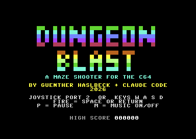
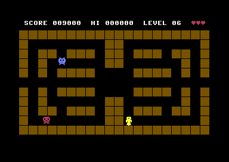

# DUNGEON BLAST - ein Labyrinth-Shooter für den C64

Ein Spiel in reinem 6502-Assembler im Stil von *Wizard of Wor*, geschrieben von Günther Haslbeck
und [Claude Code](https://claude.com/claude-code) (2026) auf einem MacBook, getestet im Emulator VICE.
Es ist ein eigenes Spiel mit eigenem Code und eigener Grafik, keine Kopie des Originals.

| Titelbild | Spiel |
|-----------|-------|
|  |  |

## Spielen

Du läufst durch ein Labyrinth und schießt in Blickrichtung auf Monster. Wenn alle Monster
erledigt sind, erscheint der **Zauberer**. Er teleportiert sich, ist schnell und schießt oft.
Ein Treffer erledigt ihn, dann geht es ins nächste Level.

| Aktion           | Joystick (Port 2) | Tastatur              |
|------------------|-------------------|-----------------------|
| Bewegen          | Richtung          | `W` `A` `S` `D`       |
| Schießen / Start | Feuer             | `SPACE` oder `RETURN` |
| Pause            |                   | `P`                   |
| Musik an/aus     |                   | `M`                   |

- **Monster:** Blaue Biester sind langsam, grüne mittelschnell und nur manchmal sichtbar
  (außer sie stehen in deiner Reihe oder Spalte), rote Totenköpfe sind schnell.
- **Punkte:** 100 / 200 / 400 für die drei Monsterarten, 1000 für den Zauberer.
- **Schießen:** Es fliegt immer nur ein eigenes Geschoss. Monster schießen zurück, wenn sie
  in einer Reihe oder Spalte mit dir stehen und nichts dazwischen ist.
- **Tunnel:** In der mittleren Reihe kann man links und rechts aus dem Labyrinth laufen und
  auf der anderen Seite wieder hinein.
- **3 Leben.** Nach einem Treffer bist du kurz unverwundbar (blinkt).
- **4 Labyrinthe** in verschiedenen Farben, 7 Stufen mit mehr und schnelleren Monstern, die
  dich zunehmend gezielt jagen. Danach geht es mit der schwersten Stufe weiter.
- Der Highscore wird für die laufende Sitzung gemerkt.

## Bauen und starten

```bash
brew install tass64 vice      # Assembler und Emulator (einmalig)

cd games/dungeonblast
python3 build.py              # -> dungeonblast.prg
python3 build.py --d64        # -> dungeonblast.prg + dungeonblast.d64

x64sc -autostart dungeonblast.prg
```

Auf einem echten C64 oder in VirtualC64: `dungeonblast.d64` einlegen und

```
LOAD"*",8,1
RUN
```

## Testen

Ohne Joystick geht der Emulator-Test mit einem Bot, der das Spiel selbst spielt:

```bash
./test.sh                       # baut den unverwundbaren Bot und macht Screenshots
python3 build.py --autoplay     # Bot, der auch sterben kann (Leben, Game Over, Highscore)
python3 build.py --autogod      # unverwundbarer Bot (Zauberer, spätere Level)
python3 build.py --show         # Labyrinthe als Text ausgeben
```

`build.py` prüft beim Bauen, dass in jedem Labyrinth alle Felder erreichbar sind und der
Tunnel offen ist. Die Testversionen (`*_auto.prg`, `*_god.prg`) sind nur für die
Entwicklung und werden nicht eingecheckt.

## Wie es funktioniert

- **Labyrinth:** 20 x 11 Felder zu je 16 x 16 Pixeln. Jedes Wandfeld besteht aus 2 x 2
  Zeichen (eigener Zeichensatz bei `$3000`). Die Karte liegt zusätzlich als Bytefeld im RAM
  (`$C100`) und dient für alle Kollisionsabfragen.
- **Sprites:** Sprite 0 Spieler (4 Blickrichtungen), Sprite 1 eigenes Geschoss, Sprites 2-6
  Monster bzw. Zauberer (je 2 Animationsbilder), Sprite 7 gegnerisches Geschoss. Die Formen
  sind in `build.py` als Text-Pixelbilder gezeichnet und liegen ab `$3800`.
- **Bewegung:** Alle Figuren laufen feldweise. Position = Feld + Pixelversatz (0-15), Schritt
  2 Pixel. Nur wenn eine Figur genau auf einem Feld steht, wird eine neue Richtung gewählt
  (der Spieler kann jederzeit umdrehen). Langsamere Monster setzen manche Bilder aus
  (`gate`-Tabelle), so bleibt die Ausrichtung auf das Raster erhalten.
- **Monster-KI:** Am Feldmittelpunkt gehen sie mit einer von der Stufe abhängigen
  Wahrscheinlichkeit in Richtung Spieler (größere Achse zuerst), sonst zufällig, nie direkt
  zurück, außer in einer Sackgasse. Schüsse werden nur abgegeben, wenn eine freie Linie zum
  Spieler besteht.
- **Zauberer:** teleportiert alle 100 Bilder auf ein zufälliges freies Feld mindestens 5
  Felder vom Spieler entfernt.
- **Ablauf:** Ein Raster-Interrupt in Zeile 250 setzt einmal pro Bild ein Flag, gibt den Ton
  aus, und die Hauptschleife führt einen Zustand aus (Titel, Bereit, Spiel, Tot, Level geschafft,
  Game Over, Pause). Sprite-Positionen werden in der Austastlücke des Bildschirms gesetzt.
- **Zufall:** 8-Bit-LFSR.
- **Ton:** SID-Stimme 1 für Effekte (Schuss, Treffer, Tod, Teleport, Level, Zauberer),
  Stimme 2 Bass, Stimme 3 Arpeggio. Die Musik ist eine 64-Schritte-Schleife in d-Moll
  (Dm - Bb - C - A).

### Speicher

| Adresse        | Inhalt                                            |
|----------------|---------------------------------------------------|
| `$0801`        | BASIC-Zeile `SYS 2064`                            |
| `$0810-$2xxx`  | Code und Tabellen (muss unter `$3000` bleiben)    |
| `$0400/$D800`  | Bildschirm / Farb-RAM                             |
| `$3000`        | Zeichensatz (ROM-Font, Block, Wandzeichen)        |
| `$3800`        | 13 Sprite-Formen                                  |
| `$C000-$C02F`  | Figuren (Feld, Versatz, Richtung, Typ)            |
| `$C100`        | aktuelles Labyrinth (220 Bytes)                   |

## Anpassen

Fast alles steht oben in `build.py`:

- **Labyrinthe:** `HALVES` (linke Hälfte, wird gespiegelt), `WALL_COLORS`
- **Monster pro Stufe:** `ENEMIES`, Jagd- und Schusswahrscheinlichkeit `CHASE`, `SHOOT`,
  Tempo `GATE`
- **Punkte:** `SCORE_HUNDREDS_BCD`
- **Sprites:** `PLAYER_BODY`, `MONSTERS`, `BULLET` als Textbilder
- **Texte und Titel:** `STRINGS`, `LOGO_LINES`, `FONT`
- **Musik und Effekte:** `CHORDS`, `ROOTS`, `BASS`, `LEAD`, `SFX`

Die Spiellogik steht in `dungeonblast.asm`.

## Dateien

| Datei                    | Zweck                                             |
|--------------------------|---------------------------------------------------|
| `dungeonblast.asm`       | Quellcode des Spiels (64tass)                     |
| `build.py`               | erzeugt die Tabellen und ruft den Assembler auf   |
| `test.sh`                | Bot-Build + Emulator-Screenshots                  |
| `dungeonblast.prg/.d64`  | fertiges Spiel                                    |
| `docs/`                  | Screenshots für dieses README                     |

## Bekannte Einschränkungen

- Auf PAL ausgelegt.
- Getestet wurde im Emulator mit Bots. Joystick und Tastatur sind nach der
  Hardware-Dokumentation programmiert, aber nicht per echter Eingabe ausprobiert. Tempo und
  Schwierigkeit muss man selbst beurteilen, sie lassen sich in `build.py` einstellen.
- Es gibt keinen Zwei-Spieler-Modus und keinen Radar wie im Original.
- Der Highscore geht beim Ausschalten verloren.
