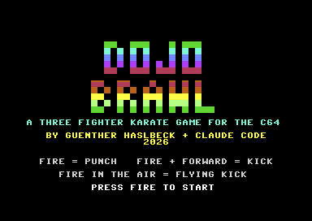
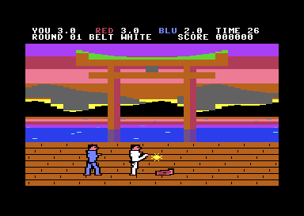
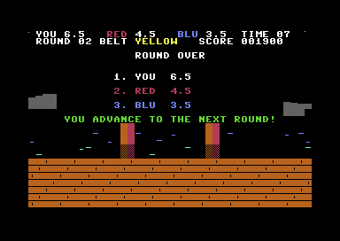
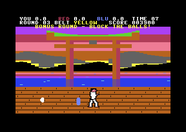
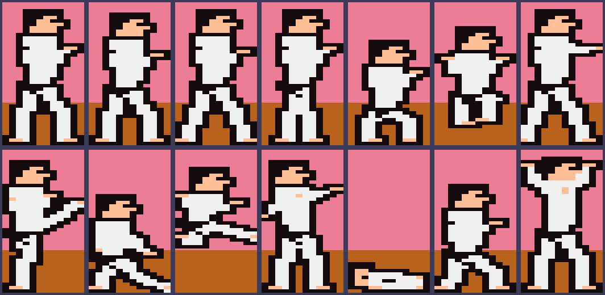

# DOJO BRAWL - ein Karate-Kampfspiel für den C64

Drei Karatekämpfer in einer Arena, im Stil von *IK+*. Das Spiel ist in reinem 6502-Assembler
geschrieben von Günther Haslbeck und [Claude Code](https://claude.com/claude-code) (2026) auf einem
MacBook und im Emulator VICE getestet. Spielprinzip und Regeln sind von IK+ inspiriert. Code, Grafik
(die Kämpfer sind in `fighters.py` aus Skelett-Posen gezeichnet, mit Kontur) und Musik sind eigene Arbeit.

| Titelbild | Kampf |
|-----------|-------|
|  |  |

| Rangliste | Bonusrunde |
|-----------|------------|
|  |  |

## Spielen

Du bist der weiße Kämpfer in der Mitte, gegen dich stehen **Rot** und **Blau**. Jeder kämpft gegen
jeden. Wer zuerst **6 Punkte** hat oder nach **45 Sekunden** vorne liegt, gewinnt die Runde.
Kommst du auf Platz 1 oder 2, geht es weiter. Wer **Letzter** ist, scheidet aus (Game Over).
Mit jeder Runde wird ein neuer Gürtel erreicht (weiß, gelb, orange, grün, blau, braun, schwarz) und
die Gegner werden stärker.

| Aktion              | Joystick (Port 2)     | Tastatur                    |
|---------------------|-----------------------|-----------------------------|
| Laufen              | links / rechts        | `A` / `D`                   |
| Springen            | hoch                  | `W`                         |
| Ducken              | runter                | `S`                         |
| Faustschlag         | Feuer                 | `SPACE` oder `RETURN`       |
| Tritt (hoch)        | Feuer + Richtung zum Gegner | wie oben              |
| Fußfeger            | Feuer + runter        |                             |
| Rücktritt           | Feuer + weg vom nächsten Gegner | trifft den Kämpfer hinter dir |
| Flugtritt           | Feuer im Sprung (oder Feuer + hoch) |              |
| Pause / Musik       |                       | `P` / `M`                   |

Die Kämpfer drehen sich automatisch zum nächsten Gegner.

### Punkte und Treffer

- Faustschlag **½ Punkt**, alle Tritte **1 Punkt**. Tritte werfen den Gegner zu Boden (er ist dann
  kurz unverwundbar und steht wieder auf).
- **Ducken** weicht Faustschlägen und hohen Tritten aus, **Springen** weicht dem Fußfeger aus.
  Der Fußfeger trifft dafür auch geduckte Gegner.
- Am Ende einer Runde gibt es **50 Spielpunkte pro halbem Punkt** und **1000** für den Sieg.

### Bonusrunde

Nach jeder zweiten Runde musst du Bälle abwehren (der Text steht in der Zeile unter der Anzeige). Sie kommen von links oder rechts in hoher, mittlerer
oder tiefer Höhe. Halte den Schild in die passende Richtung: links/rechts für die Seite, hoch/runter
für die Höhe (neutral = mittlere Höhe). Jeder geblockte Ball bringt **500**, alle zehn geblockt
bringen zusätzlich **5000**.

## Bauen und starten

```bash
brew install tass64 vice      # Assembler und Emulator (einmalig)

cd games/karate
python3 build.py              # -> dojobrawl.prg
python3 build.py --d64        # -> dojobrawl.prg + dojobrawl.d64

x64sc -autostart dojobrawl.prg
```

Auf einem echten C64 oder in VirtualC64: `dojobrawl.d64` einlegen und

```
LOAD"*",8,1
RUN
```

Benötigt wird Python 3 mit [Pillow](https://pypi.org/project/pillow/) nur für die Vorschau
(`--preview`), der eigentliche Build braucht nur die Standardbibliothek.

## Testen

Ohne Joystick spielt im Testbuild ein Bot. In allen Menüs drückt er Feuer, im Kampf nutzt er dieselbe
KI wie die Gegner, und in der Bonusrunde blockt er die Bälle:

```bash
./test.sh                       # baut den Bot und macht Screenshots (Kampf, Rangliste, Bonusrunde)
python3 build.py --autoplay     # nur bauen, dann: x64sc -autostart dojobrawl_auto.prg
python3 build.py --autolose     # der menschliche Kämpfer steht still (Test für Game Over)
python3 build.py --preview      # Kampfposen als Bild: docs/poses_preview.png
```

Die Testversionen (`*_auto.prg`, `*_lose.prg`) sind nur für die Entwicklung und werden nicht
eingecheckt.



## Wie es funktioniert

- **Kämpfer:** Jeder besteht aus zwei übereinander liegenden Multicolor-Sprites (zusammen
  24 x 42 Pixel). Haut und Haar/Gürtel kommen aus den gemeinsamen Multicolor-Registern, die
  Gi-Farbe ist die Spritefarbe des Kämpfers (weiß, rot, hellblau). Das sind 6 der 8 Sprites, Sprite 6
  ist der Treffer-Funke bzw. in der Bonusrunde der Ball, Sprite 7 der Schild.
- **Posen:** `fighters.py` zeichnet 14 Posen aus Gelenkpunkten (Kopf, Hals, Hüfte, Arme, Beine) auf
  ein 12 x 42 Raster. Daraus entstehen breite Schultern, V-Ausschnitt, dunkler Gürtel mit Knoten,
  kräftige Beine in tiefer Kampfstellung, nackte Füße, Haar und eine schwarze Kontur, damit die
  Figuren vor dem bunten Hintergrund klar stehen. Die Posen: Stand (2 Bilder), Laufen (2), Ducken, Sprung, Schlag, Tritt, Fußfeger,
  Flugtritt, Treffer, Sturz, Aufstehen, Sieg. Jede Pose gibt es gespiegelt für die Blickrichtung. Die
  Sprites liegen ab `$2800`.
- **Kampf:** Jeder Kämpfer hat einen Zustand (Stehen, Laufen, Ducken, Sprung, Schlag, Tritt, ...) mit
  Zeitzähler. Angriffe haben ein aktives Zeitfenster. In diesem prüft `hitscan` für jeden Gegner:
  Haltung (stehend / geduckt / in der Luft), Seite, Abstand und Reichweite. Pro Angriff trifft man
  jeden Gegner nur einmal. Der Flugtritt kann beide Gegner gleichzeitig treffen. Die Tabellen für
  Dauer, Fenster, Reichweite und Schaden stehen in `build.py`.
- **KI:** Alle Kämpfer, auch der menschliche im Testbuild, erzeugen dieselben Steuerbits wie ein
  Joystick (links, rechts, hoch, runter, Feuer). Die Gegner wählen alle paar Bilder eine Aktion
  (näherkommen, zurückweichen, ducken, springen, schlagen, treten, fegen, Rücktritt gegen einen Gegner
  im Rücken, Flugtritt) abhängig von Abstand und Zufall. Je höher die Stufe, desto öfter greifen sie an
  und desto häufiger weichen sie Angriffen aus.
- **Hintergrund:** Ein stilisierter Tempel im Sonnenuntergang. Ein Rasterinterrupt in Zeile 50
  schreibt für jede der 144 Zeilen eine Hintergrundfarbe (Himmel von Violett über Rot und Orange bis
  Gelb, darunter das Wasser). Berge, das große Torii-Tor (Pfeiler, Querbalken mit grüner Dachkante,
  Tafel, Spiegelbild) und die Wellen sind Zeichen aus einem eigenen Zeichensatz: Die Silhouetten
  nutzen 7 Teilhöhen-Zeichen, damit die Kanten nicht in 8-Pixel-Stufen springen. `build.py` berechnet
  die ganze Szene (`scene()`), der Holzboden davor ist ein Zeichenmuster. Die Vorlage war ein
  Foto des Itsukushima-Tores, übernommen ist nur die Komposition, nicht das Bild.
- **Ablauf:** Ein zweiter Interrupt in Zeile 250 gibt den Ton aus und setzt das Bildflag. Die
  Hauptschleife führt einen Zustand aus (Titel, Rundenstart, Kampf, Rundenende, Rangliste,
  Bonusrunde, Game Over, Pause).
- **Ton:** SID-Stimme 1 für Effekte (Schlag, Tritt, Treffer, Sturz, Start, Sieg, Block, Fehler),
  Stimme 2 Bass, Stimme 3 Melodie. Die Musik ist eine 64-Schritte-Schleife in der japanisch klingenden
  Hirajoshi-Tonleiter.

### Speicher

| Adresse        | Inhalt                                         |
|----------------|------------------------------------------------|
| `$0801`        | BASIC-Zeile `SYS 2064`                         |
| `$0810-$27FF`  | Code und Tabellen                              |
| `$0400/$D800`  | Bildschirm / Farb-RAM                          |
| `$2800`        | 60 Sprite-Formen (Kämpfer, Funke, Ball, Schild) |
| `$4000`        | Hintergrund-Szene (Zeichen + Farben, nur von der CPU gelesen) |
| `$3800`        | Zeichensatz                                    |
| `$C000-$C037`  | Kämpferdaten (Position, Zustand, Zähler, KI)   |

## Anpassen

Fast alles steht in `build.py` und `fighters.py`:

- **Kampfwerte:** `ATTACKS` (Dauer, aktives Fenster, Reichweite, Schaden, wer getroffen wird),
  `JUMP_LEN`, `STANCE`
- **Schwierigkeit:** `AGGR`, `REACT`
- **Farben der Kämpfer:** `FIGHTER_COLORS`, `SKIN`, `DARK`
- **Himmel, Wasser, Tor, Berge:** `SKY` und `scene()` (Größe und Lage des Tores, Berghöhen)
- **Gürtel:** `BELTS`
- **Posen:** `POSES` in `fighters.py` (Gelenkpunkte, danach `python3 build.py --preview` ansehen)
- **Texte und Titel:** `STRINGS`, `LOGO_LINES`, `FONT`
- **Musik und Effekte:** `LEAD`, `ROOTS`, `BASS`, `SFX`

Die Spiellogik steht in `dojobrawl.asm`.

## Dateien

| Datei                   | Zweck                                                   |
|-------------------------|---------------------------------------------------------|
| `dojobrawl.asm`         | Quellcode des Spiels (64tass)                           |
| `build.py`              | erzeugt die Tabellen und ruft den Assembler auf         |
| `fighters.py`           | zeichnet die Kämpfer-Posen und erzeugt die Sprite-Daten |
| `test.sh`               | Bot-Build + Emulator-Screenshots                        |
| `dojobrawl.prg/.d64`    | fertiges Spiel                                          |
| `docs/`                 | Screenshots und Pose-Vorschau für dieses README         |

## Bekannte Einschränkungen

- Auf PAL ausgelegt.
- Getestet wurde im Emulator mit Bots. Joystick und Tastatur sind nach der Hardware-Dokumentation
  programmiert, aber nicht per echter Eingabe ausprobiert. Wie sich die Steuerung anfühlt und wie
  schwer die Gegner sind, muss man selbst beurteilen. Beides lässt sich in `build.py` einstellen.
- Kein Zwei-Spieler-Modus, nur eine Arena und kein Kopfstoß oder Rückwärtssalto wie im Original.
- Die Figuren sind bewusst einfach gehalten (24 x 42 Pixel, Multicolor mit 3 Farben), die Posen sind
  aus Skeletten gerechnet und nicht von Hand gepixelt. Das Original hat deutlich feinere Sprites.
- Beim Wechsel zwischen Bildschirmen (Rundenstart, Rangliste) kann ein einzelnes Bild kurz flackern.
- Der Highscore geht beim Ausschalten verloren.
